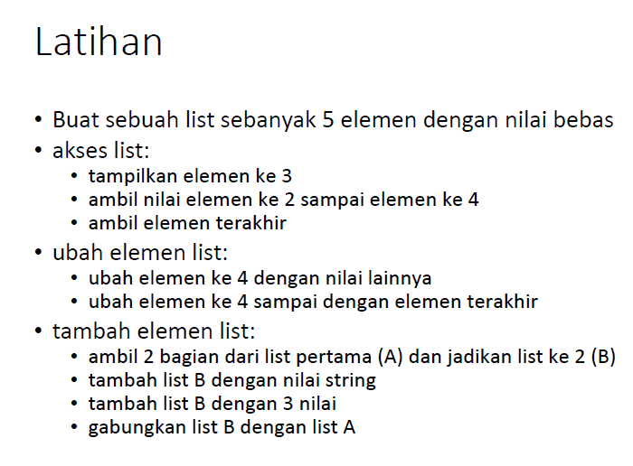
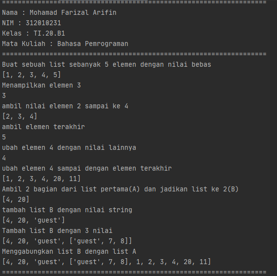

# Pertemuan9-praktikum4

Repositiry ini dibuat untuk memenuhi tugas Pertemuan 9 - Bahasa Pemrograman (Module Praktikum 4)<br><br>
Nama : Mohamad Farizal Arifin <br>
NIM : 312010231<br>
Dosen : Agung Nugroho, M.Kom<br>
Matkul : Bahasa Pemrograman<br>
Kelas : TI.20.B.1<br>

Pada halaman ini (Tugas Pertemuan-9-Module Praktikum 4) Dosen memberi tugas sebagai berikut : <br>
Ada dua bahan praktik dimodule 4 kali ini yaitu :<br>

# Yang pertama ada latihan
<br>

# Berikut ini saya menulis syntax sekaligus menuliskan langkah-langkahnya sebagai berikut

```python
# membuat list
print("Buat sebuah list sebanyak 5 elemen dengan nilai bebas")
list = [1, 2, 3, 4, 5]
print(list)

# mengakses list
print("Menampilkan elemen 3")
print(list[2])

print("ambil nilai elemen 2 sampai ke 4")
print(list[1:4])

print("ambil elemen terakhir")
print(list[-1])

# mengubah elemen list
print("ubah elemen 4 dengan nilai lainnya")
list[4]=10
print(list[3])

print("ubah elemen 4 sampai dengan elemen terakhir")
list[4:5]=[20,11]
print(list)

# Tambah elemen list
print("Ambil 2 bagian dari list pertama(A) dan jadikan list ke 2(B)")
list_pertama=list[3:5]
print(list_pertama)

print("tambah list B dengan nilai string")
list_pertama.append("guest")
print(list_pertama)

print("Tambah list B dengan 3 nilai")
list_pertama.append(["guest",7,8])
print(list_pertama)

print("Menggabungkan list B dengan list A")
gabung=list_pertama+list
print(gabung)
```
Berikut hasil run syntax latihan module 4 diatas :<br>
<br>