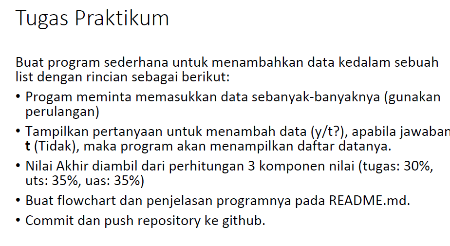
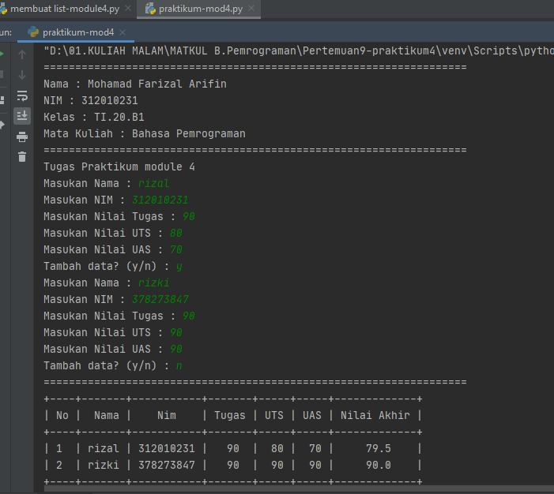
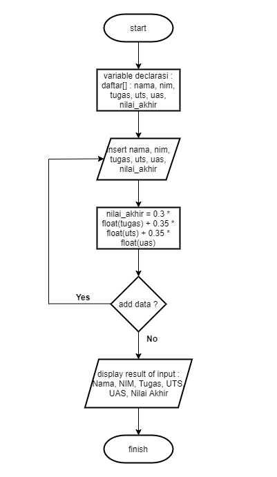

# Pertemuan9-praktikum4

Repositiry ini dibuat untuk memenuhi tugas Pertemuan 9 - Bahasa Pemrograman (Module Praktikum 4)<br><br>
Nama : Mohamad Farizal Arifin <br>
NIM : 312010231<br>
Dosen : Agung Nugroho, M.Kom<br>
Matkul : Bahasa Pemrograman<br>
Kelas : TI.20.B.1<br>

Pada halaman ini (Tugas Pertemuan-9-Module Praktikum 4) Dosen memberi tugas sebagai berikut : <br>
Ada dua bahan praktik dimodule 4 kali ini yaitu :<br>

* Soal Latihan yang ada pada module praktikum 4
<br>

* Berikut ini saya menulis syntax sekaligus menuliskan langkah-langkahnya sebagai berikut 

```python
# membuat list
print("Buat sebuah list sebanyak 5 elemen dengan nilai bebas")
list = [1, 2, 3, 4, 5]
print(list)

# mengakses list
print("Menampilkan elemen 3")
print(list[2])

print("ambil nilai elemen 2 sampai ke 4")
print(list[1:4])

print("ambil elemen terakhir")
print(list[-1])

# mengubah elemen list
print("ubah elemen 4 dengan nilai lainnya")
list[4]=10
print(list[3])

print("ubah elemen 4 sampai dengan elemen terakhir")
list[4:5]=[20,11]
print(list)

# Tambah elemen list
print("Ambil 2 bagian dari list pertama(A) dan jadikan list ke 2(B)")
list_pertama=list[3:5]
print(list_pertama)

print("tambah list B dengan nilai string")
list_pertama.append("guest")
print(list_pertama)

print("Tambah list B dengan 3 nilai")
list_pertama.append(["guest",7,8])
print(list_pertama)

print("Menggabungkan list B dengan list A")
gabung=list_pertama+list
print(gabung)
```
* Berikut hasil run syntax untuk memenuhi latihan module 4 diatas :<br><br>
<br>

* Soal Tugas praktikum module 4
<br>

* Pada soal tugas ini saya akan menulis dan menjelaskan syntax yang saya buat sebagai berikut<br>

```python
print("===================================================================")
print("Nama : Mohamad Farizal Arifin")
print("NIM : 312010231")
print("Kelas : TI.20.B1")
print("Mata Kuliah : Bahasa Pemrograman")
print("===================================================================")
print("Tugas Praktikum module 4")

# Buat program sederhana untuk menambahkan data kedalam sebuah list dengan rincian sebagai berikut: • Progam meminta
# memasukkan data sebanyak-banyaknya (gunakan perulangan) • Tampilkan pertanyaan untuk menambah data (y/t?),
# apabila jawaban t (Tidak), maka program akan menampilkan daftar datanya. • Nilai Akhir diambil dari perhitungan 3
# komponen nilai (tugas: 30%, uts: 35%, uas: 35%) • Buat flowchart dan penjelasan programnya pada README.md. • Commit
# dan push repository ke github.

from prettytable import PrettyTable

baris = []
stop = False

# masukan nilai
while (not stop):
    nama = input("Masukan Nama : ")
    nim = input("Masukan NIM : ")
    tugas = input("Masukan Nilai Tugas : ")
    uts = input("Masukan Nilai UTS : ")
    uas = input("Masukan Nilai UAS : ")
    nilai_akhir = 0.3 * float(tugas) + 0.35 * float(uts) + 0.35 * float(uas)
    baris.append([nama, nim, tugas, uts, uas, nilai_akhir])

    tanya = input("Tambah data? (y/n) : ")
    if (tanya == "n"):
        stop = True

# cetak nilai
print("===================================================================")

x = PrettyTable()
no = 0

for isi in baris:
    no += 1
    x.field_names = ["No", "Nama", "Nim", "Tugas", "UTS", "UAS", "Nilai Akhir"]
    x.add_row([no, isi[0], isi[1], isi[2], isi[3], isi[4], isi[5]])
print(x)
```
* Berikut hasil run syntax yang saya buat untuk memenuhi praktikum module 4 :<br><br>
<br>
* Flowchart program diatas adalah sebagai berikut <br>
<br>
> Penjelasan singkat tentang fungsi While untuk mengatur kondisi seperti while not stop dan jika tidak berhenti maka system akan terus menampilkan perintah user untuk meninputkan data . Untuk perhitungan nilai akhir sesuai ketentuan yang dosen inginkan. Sedangkan untuk menampilkan hasil dari inputan user tersebut menggunakan fungsi/module yang ada pada PrettyTable bisa mengakses link berikut ini untuk panduan installation : <br>
> [How to install PIP](https://phoenixnap.com/kb/install-pip-windows)<br>
>[How to install PrettyTable](https://pypi.org/project/prettytable/)<br>
>[How to install Numpy](https://stackoverflow.com/questions/60496280/python-error-modulenotfounderror-no-module-named-modulename/60496306#60496306?newreg=38536a77f74f40a691560e099363f4c3)<br>

### Demikian tugas untuk pertemuan 9 module 4 yang bisa saya sampaikan, Terima kasih...